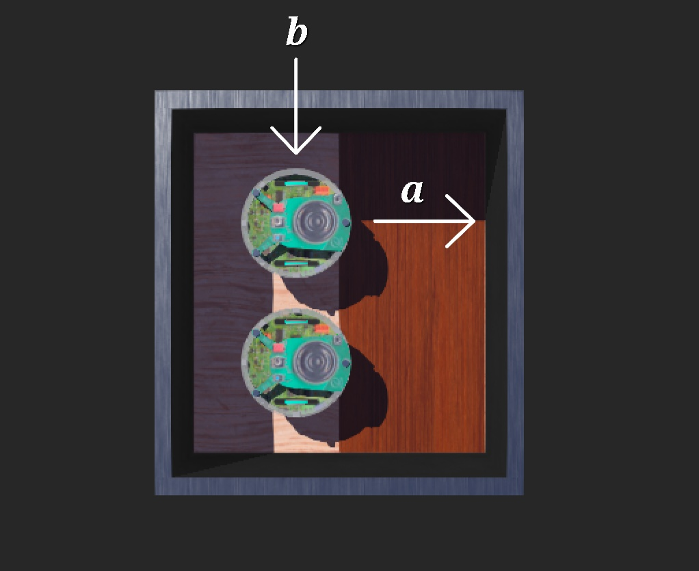
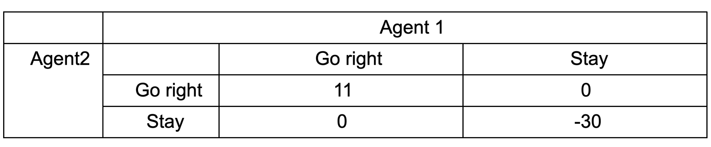

# Hysteretic Q Learning with e-puck robot in Webots

## Description

How agents learn with hysteretic Q-learning algorithm is visualized in Webots robot simulator.

Two agents interact with the environment to maximize their reward.

The two possible actions for the robots are to stay and to move to the right. They choose their actions based on soft-max action-selection method.

The reward for the agent's joint action is shown in the table below.

The parameters used for the experiment are γ = 0, α = 0.1, β = 0.01, t = 3000.

## Result

The agents successfully converge to the optimal policy around the 2600th simulation. The agents coordinate with each other with hysteretic Q learning in this matrix game.

## Acknowledgment

I would like to thank Professor Eliott at Grinnell College for inspiration.

